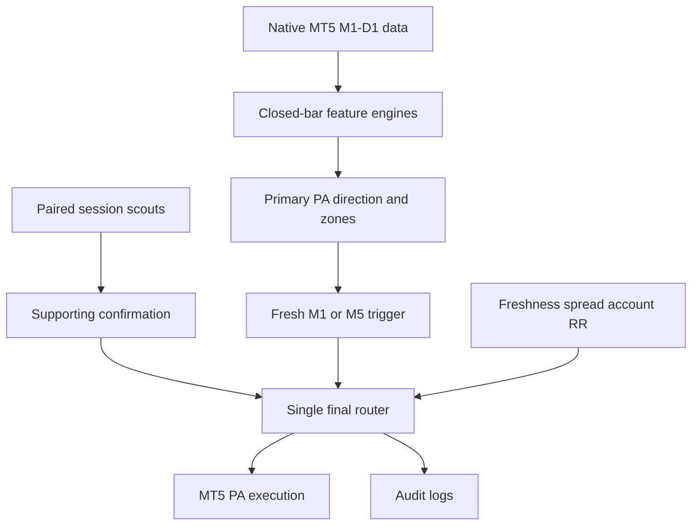

# XAUUSD Price-Action + Session-Scout Bot for MetaTrader 5

**Windows setup and running both scripts:** [README_RUN.md](README_RUN.md). Run `setup.bat` once to install MT5 and Discord dependencies, then configure `.env` before starting the launchers.

This project implements the attached specification as a modular Python bot connected to the MetaTrader 5 desktop terminal. The deterministic price-action engine is primary; paired session scouts are supporting evidence; one final router is the only component allowed to authorize a directional PA order.

The execution defaults are demo-only:

- `allow_scout_orders: true`
- `allow_pa_orders: true`
- `allow_live_account: false`

Opposing scouts require an MT5 hedging account. Netting accounts receive `SCOUTS DISABLED — ACCOUNT IS NETTING MODE`. Live accounts are rejected in code even if a configuration value is changed.

## Windows installation

1. Install MetaTrader 5, log in to a demo account, and enable Algo Trading.
2. Install 64-bit Python 3.11 or newer with the same Windows user account.
3. In PowerShell, from this project folder:

```powershell
py -m venv .venv
.venv\Scripts\Activate.ps1
pip install -e ".[mt5,dev]"
Copy-Item .env.example .env
```

The official `MetaTrader5` Python package communicates with the locally installed MT5 terminal. It is Windows-only; analysis tests can run on Linux/macOS without that package.

If MT5 does not use the already logged-in terminal session, set the environment variables from `.env.example` in PowerShell. Do not commit passwords.

## Run

One analysis cycle:

```powershell
xau-mt5-bot --config config.yaml
```

Continuous operation:

```powershell
xau-mt5-bot --config config.yaml --loop
```

Keep all order flags off for the first runs. Review `data/logs/analysis.jsonl` and `data/logs/trading.sqlite3`, confirm symbol naming/spread behavior with your broker, then enable scouts on demo only. Enable PA orders only after demo forward-testing.

## Architecture



Key modules:

| Module | Responsibility |
| --- | --- |
| `mt5_client.py` | Native MT5 history, UTC ticks, account checks, order and exact-ticket close |
| `sessions.py` | DST-aware Asia/London/New York lifecycle and broker trading dates |
| `structure.py` | Confirmed pivots, BOS/CHoCH and structure state without pivot look-ahead |
| `candles.py`, `charts.py`, `volatility.py` | Closed-candle patterns, conservative chart candidates, compression/expansion |
| `liquidity.py`, `orb.py` | Time-valid levels, all sweep events, finalized sessions and ORBs |
| `smc.py`, `zones.py` | FVGs, qualified order blocks, weighted S/R, entry selection, structural SL/TP |
| `trigger.py` | Current continuous zone visit and fresh post-touch M1/M5 confirmation |
| `scouts.py` | Hedged session pairs, MFE/MAE, close-confirm-open transition, PA magic isolation |
| `decision_router.py` | Exactly one LONG/SHORT/WAIT/NO TRADE decision function |
| `execution.py` | Bid/ask order price, volume normalization, permissions, duplicate prevention |
| `logger.py`, `report.py` | SQLite/JSONL training-ready audit trail and readable output |

## Tests

```powershell
pytest
```

The suite covers DST transitions, broker trading dates, ORB and liquidity `valid_from`, multiple sweeps, hedging refusal, scout session transitions, forced scout closes, scout/PA magic separation, current zone visits, stale trigger prevention, fresh M5 confirmation, actual bid/ask RR, spread rejection, stale-data veto, and the single-router invariant.

## Current scope

Implemented in v1:

- Native M1/M5/M15/H1/H4/D1 history with forming-vs-closed separation
- Confirmed swings, HH/HL/LH/LL state, BOS and CHoCH event timestamps
- Core candle families, FVGs, displacement-qualified order blocks, S/R clusters
- Previous period, daily, session, round and ORB liquidity levels with temporal validity
- Multiple sweep/reclaim events
- Paired real session scouts with hedging/live/demo/order safety
- Current-visit M1 trigger and fresh M5 break/retest alternative
- Structural SL/TP, actual bid/ask RR, daily ATR realism, spread/freshness vetoes
- One decision router, MT5 execution, JSONL and SQLite audit logging

Conservative extension points (not claimed as production-calibrated):

- Complex triangles, wedges, flags, pennants and channels
- Failed-BOS/retest classification beyond core BOS/CHoCH events
- Breaker blocks, inversion FVG, VWAP, volume/relative volume, SMT/DXY/US10Y
- Partial exits, break-even, trailing, portfolio limits and AI/ML inference

See `EXAMPLE_REPORTS.md` for LONG, SHORT, WAIT and active-position output examples.

## v3.1.0 — silver correlation + Discord commands (Sep 6 2026)

- `intermarket.py`: XAU/XAG rolling correlation, relative strength and M15 SMT divergence as a capped (8-point) confluence family,
  active only while the metals are COUPLED (r ≥ 0.50). Evidence only; degrades to UNAVAILABLE without blocking a cycle.
- `discord_bot.py` + `run_discord_bot.bat`: read-only command bot (`!status !plan !silver !scouts !positions !day !trades !go
  !events !reports !heartbeat`). Needs `DISCORD_BOT_TOKEN` in `.env`, `pip install -e ".[discord]"`, Message Content Intent on.
- 212 passing tests. See `RELEASE_NOTES_v3.1.0.md`.

## v3.0.0 — demo-only analysis & validation build (Sep 6 2026)

- MT5 attach without credentials (`mt5.initialize()` only), demo/hedging/symbol/tick validation, credential-free reconnect.
- v2.4 defects 5.1–5.6 fixed; funded semantics replaced by `signal_go` demo-signal semantics; `$10` session feasibility,
  setup-outcome tracking with deterministic fakeout/continuation labels, pattern reliability with fallback hierarchy and
  Wilson intervals, multi-timeframe alignment/treatment. 195 passing tests. See `RELEASE_NOTES_v3.0.0.md`.
- Breaking config: `reporting.*` renamed to `research_*`; `session_target` and `outcomes` blocks added; `.env` has no MT5 credentials.

## v2.4.0 — fifth independent-review fixes (Sep 6 2026)

- Fingerprint-scoped Friday-close GO, NULL-safe and transactional trade-identity migration, durable pending session
  summaries across a boundary-cycle crash, backfilled idempotency keys. 161 passing tests. See `RELEASE_NOTES_v2.4.0.md`.

## v2.3.0 — fourth independent-review fixes (Sep 6 2026)

- Composite trade identity (account, symbol, ticket) with in-place migration, fingerprint-scoped GO tallies, funded settings
  in the fingerprint, idempotent-first scout statistics (`event_once`), read-then-consume GO reports. 154 passing tests at v2.3.0.
  See `RELEASE_NOTES_v2.3.0.md`.

## v2.2.0 — third independent-review fixes (Sep 6 2026)

- Account-scoped strategy readiness, per-instance GO tallies, fingerprint-checked pending scout summary, cycle-dated
  Firestore events, bounded queue shutdown, idempotent session stats. 144 passing tests at v2.2.0. See `RELEASE_NOTES_v2.2.0.md`.

## v2.1.0 — second independent-review fixes (Sep 6 2026)

- Symbol in scout stats, account/symbol/fingerprint scoping of every report query and key, independent Discord/Firestore
  queues with result write-back, unconditional drain, close-date P/L attribution, persisted GO tallies and Friday-close GO,
  persisted pending pair summary, fingerprint-matched live samples, strict config (`extra="forbid"`).
- The suite contained 134 passing tests at v2.1.0. See `RELEASE_NOTES_v2.1.0.md`.

## v2.0.0 — independent-review fixes (Sep 6 2026)

- Fixes all 19 findings of the v1.9.0 review: MT5 filling-mode mapping, risk-lock ordering, calibration integrity/scope,
  trigger-bar freshness, cold-start NO_TRADE, atomic state files, early-close boundaries, currency-vs-price funded gate
  (`daily_target_usd: 500`, `max_manual_risk_usd: 1500`), fingerprint at open, scoped scout stats, historical GO, Firestore
  schema/date/discord-result/series continuity/forced push, Discord operational events, two drained delivery queues.
- Breaking: `reporting.max_manual_risk_to_daily_target_ratio` removed. See `RELEASE_NOTES_v2.0.0.md`.

## v1.9.0 — 3-second poll, out-of-process pattern scan, scoped reports (Sep 6 2026)

- `poll_seconds: 3`. Pivot/structure detection vectorised (identical output, ~3x faster); warm cycle 0.96 s on the build box.
- 30-day pattern scan runs in a low-priority worker process (no GIL contention); failures audited and retried;
  `reporting.pattern_scan` exposes status/age. Fingerprint covers sessions/safety/magic; weekly and session reports scoped to it.
- Pace-calibration state file authoritative, `scout_analysis.reset_pace_calibration` for a deliberate reset. `cycle_slow` audit event.
- See `RELEASE_NOTES_v1.9.0.md`.

## v1.8.0 — cycle-time, trigger-delay and readiness fixes (Sep 5 2026)

- Per-cycle analysis window back to 1,200 M5 bars; 30-day pattern scan on a separate window, cached per closed M5 bar and
  refreshed in a background thread. Trigger detection-delay applies to first detection only.
- Funded GO ratio 3.0 ($15 1-lot risk), persisted pace-calibration counter, strategy fingerprint on every trade record.
- See `RELEASE_NOTES_v1.8.0.md`.

## v1.7.0 — restart, integration and funded-readiness hardening (Sep 5 2026)

- A 30-day pattern lookback now forces an effective 8,640-bar M5 detector window and rejects configurations whose history cannot supply it.
- Weekly and Friday reports catch up on startup and deduplicate through SQLite; a missed Monday-Asia or Friday-close process cycle no longer loses the report.
- Startup is separate from a genuine session end, so restarting cannot activate `close_pa_at_session_end`.
- Scout exits finalize before the next pair is opened. Realized PA and scout P/L both feed the daily-loss and consecutive-loss lock.
- Historical reports use `report_status` and `actionability`; only a current live snapshot has `GO`/`NO-GO`.
- Rolling pace is unsigned; direction is exposed separately as `velocity_direction` from session displacement.
- Broker holiday and early-close overrides are configurable, with exponential transition retry backoff when the feed is unavailable.
- SQLite timestamps/retention are UTC-safe, startup runs WAL/quick-check recovery, and deal lookup begins at the position's actual open time.
- Firestore series are capped at 240 samples and a machine-readable `FIRESTORE_SCHEMA.json` is contract-tested.
- Discord splits long messages and retries HTTP 429 with bounded backoff. Missing integrations produce visible startup warnings.
- `.env` is authoritative over stale inherited Windows values; relative Firebase paths resolve from the project directory.
- Netting accounts are classified as a permanent unsupported scout mode for that boundary instead of being retried continuously.
- Scout strength uses broker profit calculation, then symbol tick economics, then an explicit per-symbol configuration; unknown symbols cannot produce a directional scout verdict silently.
- Slow-market holding remains inactive until 20 completed scout sessions. Funded `GO` additionally requires 20 confirmed PA outcomes and translated one-lot plan risk no greater than the configured $5 limit.
- Scout-pair costs and SL risk are labelled separately at actual demo volume and at the one-lot translation. Scout mirroring is explicitly prohibited.

The suite contains 74 passing tests. Read `FORWARD_TEST_CHECKLIST.md`; Windows/broker behavior and strategy profitability remain external evidence requirements.

## v1.6.0 — forward-test readiness pass (Sep 5 2026)

- Replaced session-average velocity with a persisted 20-minute rolling midpoint-range pace. Retracement therefore does not erase evidence that the market moved quickly.
- Added a 15-minute session grace and five-minute minimum sample span. These use `WARMUP`, which never triggers the slow-market hold.
- Friday next-week outlook now fires only after the New York close boundary; weekly SQL runs only on the first Asia boundary of the broker week.
- Session summaries include pending-finalization PA tickets. Weekly reports add scout leaders, average leg MFE/MAE and defined leader-vs-PA accuracy.
- `order_calc_profit` fallback produces a once-per-process audit/Discord warning and the snapshot records `BROKER_CALC` or `FALLBACK`.
- Per-leg scout order/close Discord noise is suppressed. Pair lifecycle messages are collapsed and rate-limited.
- Console, Discord and Firestore include explicit `GO`/`NO-GO`, one-lot translations, and progress against display-only $5/day and $1,500/month targets.
- Pattern scanning uses configurable `pattern_lookback_days` while structure/history windows remain separately bounded.
- Forward-test defaults are non-zero: 2% daily loss stop, three consecutive losses and a $20 emergency scout SL. These are safety limits, not profit guarantees.
- Added `FIRESTORE_SCHEMA.md`, authenticated-read/client-write-deny `firestore.rules`, `WINDOWS_DEPLOYMENT.md`, and mocked MT5 adapter contract tests.

The suite contains 58 passing tests. A real Windows broker-demo run remains mandatory before relying on terminal or integration behaviour.

## v1.5.0 — Dacoit reporting and market-context pass (Sep 5 2026)

- Scout velocity is now labelled `SLOW`, `NORMAL`, or `FAST` using configurable price-per-minute thresholds.
- Slow pace can instruct the final router to `HOLD — wait for the next session unless velocity improves`.
- Scout verdict and strong-contradiction thresholds are configurable; price-equivalent strength uses broker profit calculation when available.
- Previous-year high/low (`PYH`/`PYL`) are derived from native D1 history and enter the normal liquidity/sweep pipeline.
- Persistent, deduplicated session summaries, completed-week reports, and Friday next-week-open outlooks are emitted to the audit/notification pipeline.
- Discord receives the complete scout lifecycle, including open, close, rollback, repair and adoption events.
- Discord displays the actual configured timezone abbreviation instead of hardcoding `IST`.
- Firestore snapshots and telemetry include market-speed context and user guidance.

The suite now contains 44 passing tests. Windows demo verification is still required for live MT5 terminal, broker, Discord, and Firestore behaviour.

## v1.4.0 — execution-correctness pass (Sep 5 2026)

- Partial-managed PA orders open with structural SL and no full-position TP1.
- TP1 closes the configured percentage; only a confirmed close moves SL to entry plus spread/offset.
- TP2 closes its percentage of original volume; only a confirmed close locks SL at TP1.
- The remaining runner trails confirmed M5 structure with ATR fallback and can close at TP3.
- Partial fills are accepted and tracked without a blind hedging-account top-up.
- LONG management uses bid; SHORT management uses ask. Actual fill replaces requested entry for risk/RR.
- M5 triggers require a confirmed pivot formed in the current zone visit and preserve setup/zone/direction ownership.
- Liquidity sweep identity includes kind, price, direction and candle timestamp.
- Invalid zones and expired sweeps cannot add evidence; failed structure breaks support the opposite side.
- Exit-deal aggregation includes every partial/final deal, commission and swap. Unresolved finalization persists indefinitely.
- Scout volume equality and close confirmation are enforced; session transition retries do not expire.
- SQLite v1.1/v1.2 tables and legacy `positions.json` state are migrated in place.
- Management messages expose SL changes, locked profit, completed targets and remaining volume.

The v1.4 release originally contained 38 tests. Passing tests demonstrate deterministic lifecycle behavior, not profitability. A Windows terminal smoke test is still required with the intended broker's demo symbol.

Thresholds are starting defaults, not validated profitability claims. Backtest and forward-test them on the exact broker symbol, commission, spread, slippage and contract specification before enabling orders.


## v1.1 — dacoit wiring (Sep 5 2026)

Flags in `config.yaml` are now `allow_scout_orders: true`, `allow_pa_orders: true`, `allow_live_account: false` — the bot places scout pairs and the PA trade on a DEMO account only; a live account is refused at attach (`validate_terminal`) and again by `account_is_safe()`.

| Add-on | File | What it does |
| --- | --- | --- |
| Discord | `notify.py` | Message on every decision/entry-state change, otherwise one status per 5 min; all audit events (session transitions, scout stats, orders, errors, clock warning, startup/shutdown) fan out too. Set `DISCORD_WEBHOOK` in `.env`. |
| Firebase | `firestore_sink.py` | `sessions/{tradingDate_SESSION}` summary every 5 min (price, structure, PA, scouts, plan, final, patterns, sweeps, levels), `heavy/series` every 30 s, `days/{date}`, `events`, `telemetry/{date}`. Put `serviceAccountKey.json` beside `config.yaml`. Vue subscribes with `onSnapshot`. |
| Telemetry | `telemetry.py` | cycle ms avg/max, cycles, error count, last errors, last decision → `data/heartbeat.json` every 60 s and Firestore `telemetry`. |
| Restart | `supervisor.py`, `run.bat` | Child-process supervisor: restarts on exit/crash with 5→120 s backoff, kills+restarts when the heartbeat is >180 s stale; `main.py` itself reconnects MT5 after 3 consecutive cycle errors and exits(3) if that fails. Run `run.bat` from Task Scheduler (At log on). |

Engine fixes in the same pass: TP pool excludes ROUND_1 / TODAY_H-L and requires ≥0.8×risk distance (was blocking every trade on RR); round-number levels no longer collapse to one per increment; history cached and tail-refreshed each cycle; detectors run on a bounded window (`analysis_window_bars`) — cycle ≈1.8 s; today-range uses the broker trading date; momentum family + counter-trend/exhaustion penalties added to confluence; M5 confirmation breaks the visit extreme, not one bar; M1 trigger expiry 30 bars; startup clock check warns if MT5 tick time is >1 h from system UTC.

## v1.2 — core pending items (Sep 5 2026)

| # | Item | Where |
| --- | --- | --- |
| 1 | Restart recovery: adopts the scout pair of the current session, closes pairs left from ended sessions, re-tracks PA/scout positions from `data/positions.json` | `scouts.adopt_existing`, `position_manager.adopt_untracked` |
| 2 | Failed session transitions retried each cycle up to `transition_retry_limit`, superseded boundaries dropped | `engine._handle_sessions` |
| 3 | Broker clock validation every cycle (`max_clock_skew_seconds`); skew blocks every order via `orders_allowed()` | `engine._validate_clock` |
| 4 | PDH/PDL/PDC from native D1 bars; daily open / today range from the last native D1 open; PWH/PWL/PMH/PML grouped by broker trading date | `liquidity.previous_period_levels`, `current_daily_levels` |
| 5 | Round numbers keyed by price in `_latest_levels`; larger increment wins the label | `engine._latest_levels` |
| 6 | TP candidates must be ≥ `min_actual_rr × risk` away, so TP1 always satisfies the router | `zones.build_trade_plan(min_rr)` |
| 7 | `PositionManager` runs every cycle | `engine.run_cycle` |
| 8 | PA monitoring: MFE/MAE per cycle, close on M5 close beyond invalidation (zone low/high), external closes detected | `position_manager.update` |
| 9 | `pa_risk_percent` sizing from balance / SL distance / tick value; `fixed_pa_lot` when percent is 0 | `execution.risk_based_volume` |
| 10 | `order_check` (margin, stops level, trade mode) + volume normalisation before every send | `mt5_client.order_check`, `execution.send_with_retry` |
| 11 | Position verified after send; partial fills reported in the order message | `execution.send_with_retry` |
| 12 | Total-volume limit = existing + proposed | `execution.account_is_safe(proposed_volume)` |
| 13 | `retry_count` retries on requote/reject/price-changed retcodes | `execution.send_with_retry` |
| 14 | Missing scout leg re-opened if < 50 % of session elapsed, otherwise the orphan leg is closed | `scouts.repair_leg` |
| 15 | Weekend (Fri 17:00 → Sun 17:00 NY), stale tick, closed symbol → no orders, session = CLOSED | `sessions.market_open`, `engine.orders_allowed` |
| 16 | `trades` table: ticket, kind, side, session, volume, open/close time+price, SL/TP, P/L (from deal history), MFE, MAE, duration, exit reason | `logger.trade`, `mt5_client.closed_deal` |
| 17 | Confluence uses current-cycle today-range/ATR; −10 for a strong opposing S/R zone within 1.5 ATR | `engine._price_action_direction` |
| 18 | VWAP (session-anchored), breaker blocks, premium/discount, trendlines, equal H/L, swing pools, failed BOS / retest status, OB untouched/mitigated/broken, FVG fill % | `context.py`, `smc.py`, `structure.py`, `liquidity.py` |
| 19 | Confirmed trigger carried for `trigger_grace_m1_bars` after price leaves the zone (≤ 1 ATR beyond) | `trigger.carry_trigger` |
| 20 | History cache keyed by symbol + account login; gap after reconnect forces a full refetch; `reset_history_cache()` on MT5 reconnect | `history.py` |

Tests: 21 passing (`pytest`). Cycle time ≈ 2.5 s on 1200 M5 / 600 M1 windows.

## v1.3 — pending-problems pass (Sep 5 2026)

| # | Status | Where / note |
| --- | --- | --- |
| 1 | done | `engine`: `setup_id = side|zone kind|bounds|valid_from`; trigger cleared when the setup id changes (`trigger_cleared` event), consumed after an order (`trigger_consumed`) |
| 2 | done | `structure` tags `Failed …` events; `_price_action_direction` scores a failed break for the opposite side (+4) and −3 for its own |
| 3 | done | `round_number_levels(valid_from=D1 open)`; closed candles can sweep them |
| 4 | done | `NEUTRAL_PREFIXES` (ROUND_, DAILY_OPEN, PDC, VWAP, WEEKLY/MONTHLY_OPEN) scanned from both sides |
| 5 | done | `ScoutManager._send` → `send_with_retry` (normalise, order_check, retry, fill verify) |
| 6 | done | `account_is_safe(for_scouts, proposed=2×lot)` before the pair, `1×lot` before a repair |
| 7/8 | done | `_close()` confirms; unconfirmed closes go to `pending_closures`, persisted and retried every cycle |
| 9 | done | `data/positions_<login>_<server>_<symbol>.json`, `scouts_<…>.json` |
| 10 | done | closed positions go to `pending_finalize`; recorded only when `closed_deal()` returns (up to 6 cycles), `result_confirmed` flag |
| 11 | done | `risk_per_lot` via `order_calc_profit`; `size_basis: balance|equity`; sizing rejected when min volume exceeds permitted risk |
| 12 | done | `normalize_price` (tick size/digits); `order_check` validates SL/TP side + stops/freeze level |
| 13 | done | partial fill: one top-up of the remainder, `plan.volume` = actual filled volume |
| 14 | done | repair fraction from `engine._session_bounds()` (DST-aware START/END) |
| 15 | done | `emergency_scout_sl_price` applied to both legs |
| 16 | done | setup registry: `max_entries_per_setup`, `setup_cooldown_minutes`, open-position guard |
| 17–19 | done | `PositionManager._manage`: break-even at `breakeven_at_rr` (+offset), trailing (`trailing_atr`, `trailing_start_rr`), TP1/TP2 partials by % of original volume, remainder runs to TP3 |
| 20–24 | done | `entry_allowed()`: daily max loss %, daily profit lock %, max trades/day and /session, consecutive-loss lock; persisted per trading date |
| 25 | done | `close_pa_at_session_end` (`_session_ending` = within 2 polls of the boundary) |
| 26 | done | tracked PA state (invalidation, plan, BE/TP flags) restored from the account-keyed file; `pa_management_restored` event |
| 27 | done | `_latest_levels` keeps multiple SWING_/EQUAL_/ROUND_ by kind+price |
| 28 | done | breaker lifecycle: created → retested/mitigated/rejected; invalidated breakers dropped |
| 29 | done | OB states: untouched, 25/50/75 % mitigated, fully mitigated, rejected, broken |
| 30 | done | inversion FVG (`*_INVERSION_FVG`: created/retested; invalidated dropped) |
| 31 | done | trendlines need `trendline_min_touches` (3), slope ≤ 0.15 ATR/bar, age ≤ 400 bars; states respected/testing/broken/broken+retested |
| 32 | done | premium/discount from the impulse leg of the last confirmed BOS/CHoCH (`confirmed_range` flag) |
| 33 | done | VWAP ±1σ bands; states above/below/at/reclaim/cross_below/rejection_from_*; neutral for sweeps |
| 34 | done | `sweep_max_age_bars` (48): only active sweeps feed confluence; SL uses the latest active sweep |
| 35 | done | M5 confirmation breaks a pivot confirmed inside the current visit (visit extreme only when no pivot exists yet) |
| 36 | done | scout extrema persisted in `scouts_<account>.json`, restored on start |
| 37 | done | `scout_order`, `scout_close`, `scout_close_retry`, `scout_rollback`, `scout_leg_repaired`, `order_attempt` events |
| 38 | done | `AuditLogger.context` (account, symbol) merged into every order/trade record; `setup_id`, `result_confirmed` columns |
| 39 | done | daily JSONL rotation, hourly prune of snapshots/events/rotated files older than `retention_days` (30) |
| 40 | done | Discord/Firestore/telemetry calls run on a daemon delivery thread via a bounded queue |

Not completed / deliberately partial:
- 13: only one top-up attempt for a partial fill; the bot does not cancel a remaining unfilled volume because market orders on MT5 have no resting remainder — the "cancel" case does not exist for `TRADE_ACTION_DEAL`.
- 19: TP3 runner has no separate exit rule beyond trailing/BE/invalidation — "runner" here means the broker TP is moved to TP3 after TP2; a time-based or structure-based runner exit needs live data to calibrate.
- 31: trendlines still use pivots only (no wick-touch counting between pivots); adding wick touches multiplied cycle time and gave no different lines on synthetic data.
- Cycle time ≈ 2.2 s after vectorising `detect_sweeps` (was 11 s with neutral levels).
